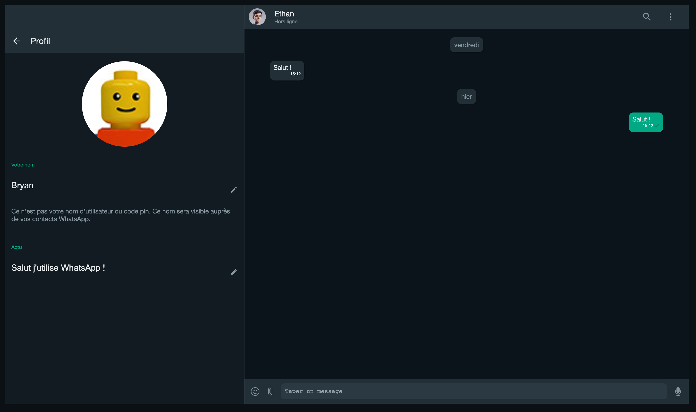
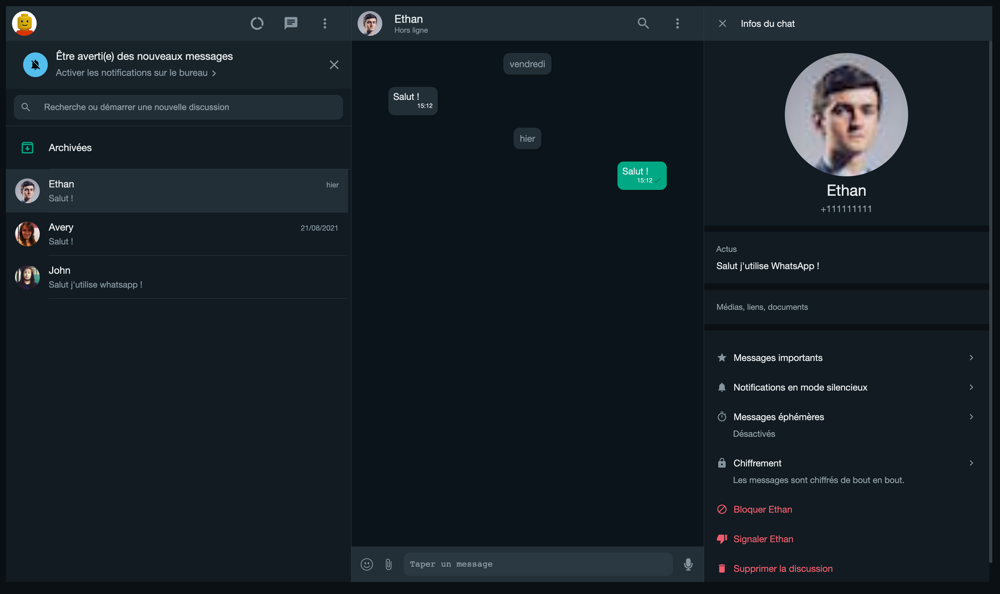

# WhatsApp Web Clone (Client)

This is a clone of the WhatsApp web application developed in [React](https://reactjs.org/)

## Technical Stack

- ⚛️ React 18
- 🔥 Typescript 4
- 🔥 Express 4
- 🔥 Mongo DB
- ✅ Socket.io
- ✅ Redux
- ✅ SASS
- ✅ React Router 6

## Overviews

## Demo

https://whatsapp-web-clone-client.netlify.app/
