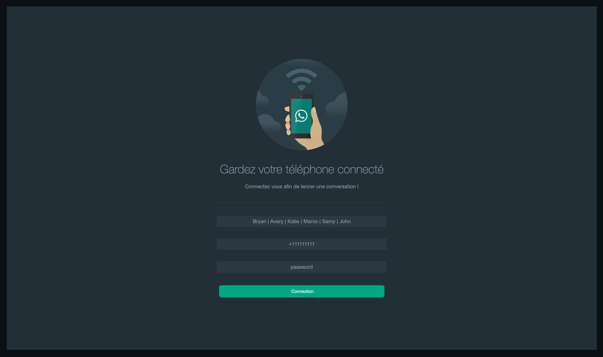
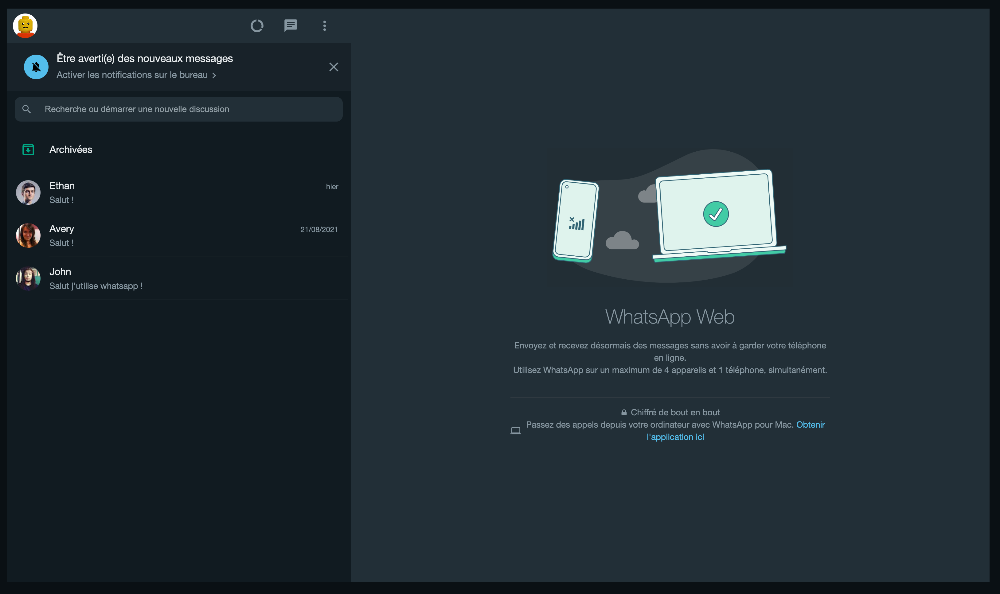
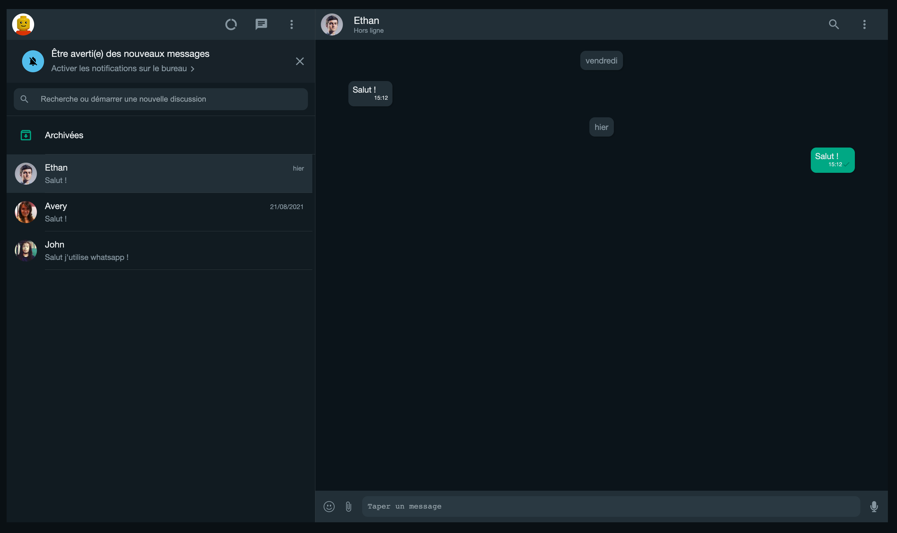
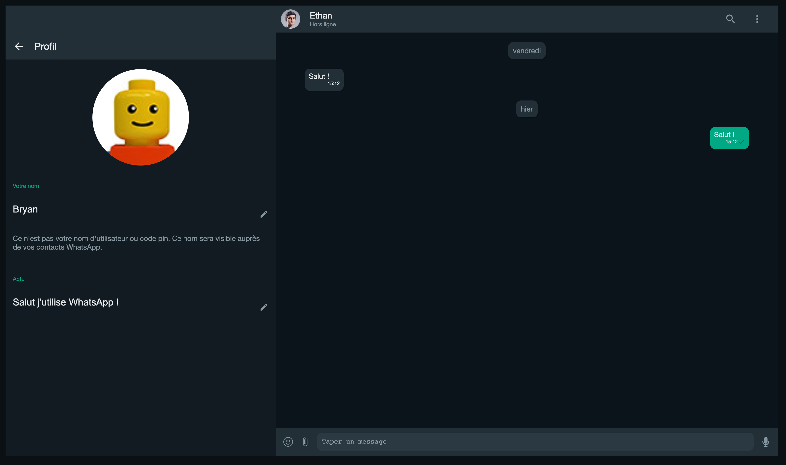
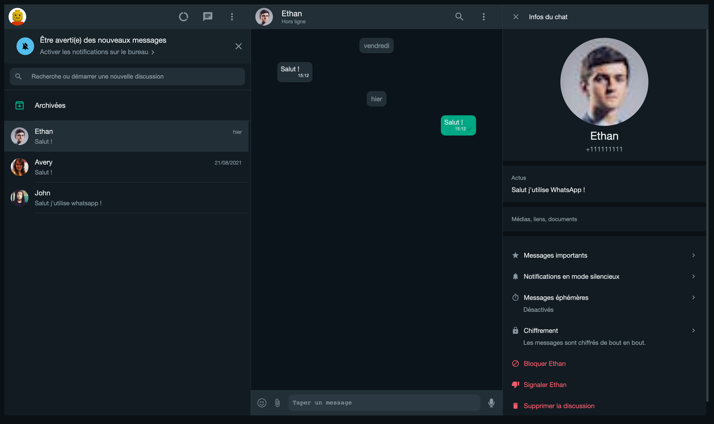

# WhatsApp Web Clone (Client)

This is a clone of the WhatsApp web application developed in [React](https://reactjs.org/)

## Technical Stack

- ⚛️ React 18
- 🔥 Typescript 4
- 🔥 Express 4
- 🔥 Mongo DB
- ✅ Socket.io
- ✅ Redux
- ✅ SASS
- ✅ React Router 6

## Features

- Realtime chat
- Account login and logout
- Routes (login and main)
- Authentication middleware to secure requests (jsonwebtoken)
- Light and dark mode theming (automatically detected according to user's settings)
- User information update
- Creation of new discussions

## Possible improvements

- Use emoji, audio or pictures for the messages
- Settings
- Notifications (desktop, browser tab)
- Add style animations
- Set messages as important
- Forward messages
- Reply to message
- Can use vocal to send message
- Search text on chat
- Secure socket with token

## Overviews

## Demo

https://whatsapp-web-clone-client.netlify.app/
